---
## Front matter
title: "Лабораторная работа №2"
subtitle: "Архитектура компьютера"
author: "Мурашов Иван Вячеславович"

## Generic otions
lang: ru-RU
toc-title: "Содержание"

## Bibliography
bibliography: bib/cite.bib
csl: pandoc/csl/gost-r-7-0-5-2008-numeric.csl

## Pdf output format
toc: true # Table of contents
toc-depth: 2
lof: true # List of figures
lot: true # List of tables
fontsize: 12pt
linestretch: 1.5
papersize: a4
documentclass: scrreprt
## I18n polyglossia
polyglossia-lang:
  name: russian
  options:
	- spelling=modern
	- babelshorthands=true
polyglossia-otherlangs:
  name: english
## I18n babel
babel-lang: russian
babel-otherlangs: english
## Fonts
mainfont: PT Serif
romanfont: PT Serif
sansfont: PT Sans
monofont: PT Mono
mainfontoptions: Ligatures=TeX
romanfontoptions: Ligatures=TeX
sansfontoptions: Ligatures=TeX,Scale=MatchLowercase
monofontoptions: Scale=MatchLowercase,Scale=0.9
## Biblatex
biblatex: true
biblio-style: "gost-numeric"
biblatexoptions:
  - parentracker=true
  - backend=biber
  - hyperref=auto
  - language=auto
  - autolang=other*
  - citestyle=gost-numeric
## Pandoc-crossref LaTeX customization
figureTitle: "Рис."
tableTitle: "Таблица"
listingTitle: "Листинг"
lofTitle: "Список иллюстраций"
lotTitle: "Список таблиц"
lolTitle: "Листинги"
## Misc options
indent: true
header-includes:
  - \usepackage{indentfirst}
  - \usepackage{float} # keep figures where there are in the text
  - \floatplacement{figure}{H} # keep figures where there are in the text
---

# Цель работы

Целью работы является изучить идеологию и применение средств контроля версий, а также приобрести практические навыки по работе с системой git.

# Задание

1. Настройка GitHub;
2. Базовая настройка Git;
3. Создание SSH ключа;
4. Создание рабочего пространства и репозитория курса на основе шаблона;
5. Создание репозитория курса на основе шаблона;
6. Настройка каталога курса;
7. Выполнение заданий для самостоятельной работы.

# Выполнение лабораторной работы

## Настройка GitHub

Поскольку у меня есть учётная запись на сайте https://github.com/ и основные данные заполнены (рис. [-@fig:001]), перехожу к следующему шагу лабораторной работы. 

{#fig:001 width=70%}

## Базовая настройка git

Сначала я делаю предварительную конфигурацию git. Открываю терминал и ввожу следующие команды, указав имя и email моего репозитория (рис. [-@fig:002]).

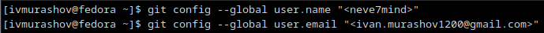{#fig:002 width=70%}

Затем настраиваю utf-8 в выводе сообщений git, задаю имя начальной ветки (буду называть её master), настраиваю параметры autocrlf и safecrlf (рис. [-@fig:003]).

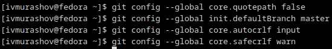{#fig:003 width=70%}

## Создание SHH ключа

Для последующей идентификации пользователя на сервере репозиториев необходимо сгенерировать пару ключей (приватный и открытый). Для этого я ввожу команду 'ssh-keygen -C "Имя Фамилия <work@mail>"', указывая имя пользователя и электронную почту (рис. [-@fig:004]). Ключ автоматически сохраняется в каталоге ~/.ssh/.

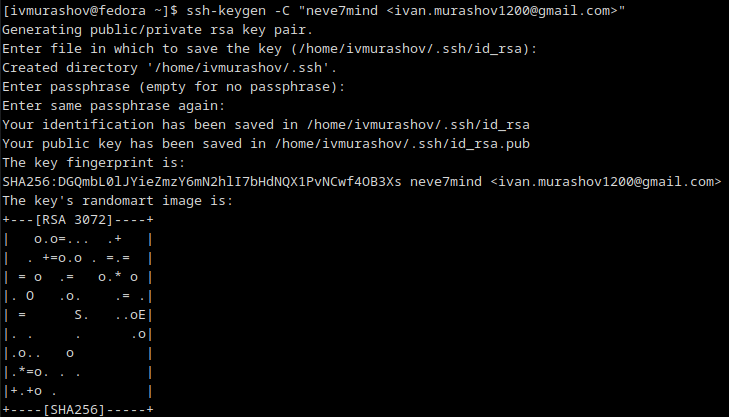{#fig:004 width=70%}

Далее необходимо загрузить сгенерированный открытый ключ. Для этого копирую из локальной консоли ключ в буфер обмена с помощью команды 'cat ~/.ssh/id_rsa.pub | xclip -sel clip' (рис. [-@fig:005]).

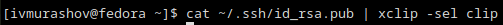{#fig:005 width=70%} 

Захожу на сайт http://github.org/ под своей учётной записью и перехожу в меню Settings. После этого выбираю в боковом меню SSH and GPG keys и нажимаю кнопку New SSH key. Вставляю ключ в появившееся на сайте поле и указываю для ключа имя (Title) (рис. [-@fig:006]). 

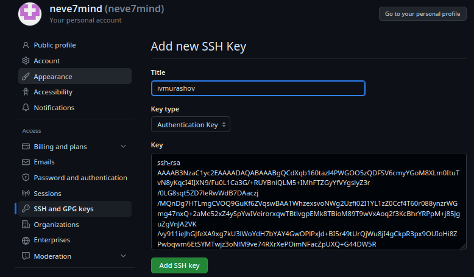{#fig:006 width=70%}

## Cоздание рабочего пространства и репозитория курса на основе шаблона 

Открываю терминал и создаю каталог для предмета «Архитектура компьютера» с помощью команды 'mkdir'. Проверяю наличие каталога в корневом каталоге с помощью команды 'ls' (рис. [-@fig:007]). 

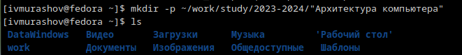{#fig:007 width=70%}

## Создание репозитория курса на основе шаблона 

Репозиторий на основе шаблона можно создать через web-интерфейс github. Перехожу на станицу репозитория с шаблоном курса https://github.com/yamadharma/course-directory-student-template. Выбираю Use this template. В открывшемся окне задаю имя репозитория (Repository name) study_2023-2024_arhpc и создаю репозиторий (Create repository from template) (рис. [-@fig:008]). 

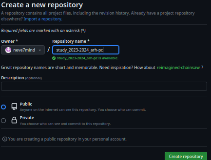{#fig:008 width=70%}

Открываю терминал и, переходя в каталог курса: cd ~/work/study/2023–2024/"Архитектура компьютера",  клонирую созданный репозиторий (рис. [-@fig:009]). 

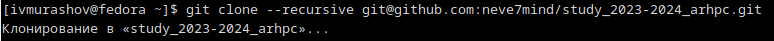{#fig:009 width=70%}

## Настройка каталога курса

Перехожу в каталог курса, удаляю лишние файлы, создаю необходимые каталоги и отправляю файлы на сервер (рис. [-@fig:010]).

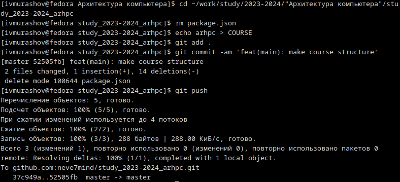{#fig:010 width=70%} 

Проверяю правильность создания иерархии рабочего пространства в локальном репозитории и на странице github (рис. [-@fig:011]).

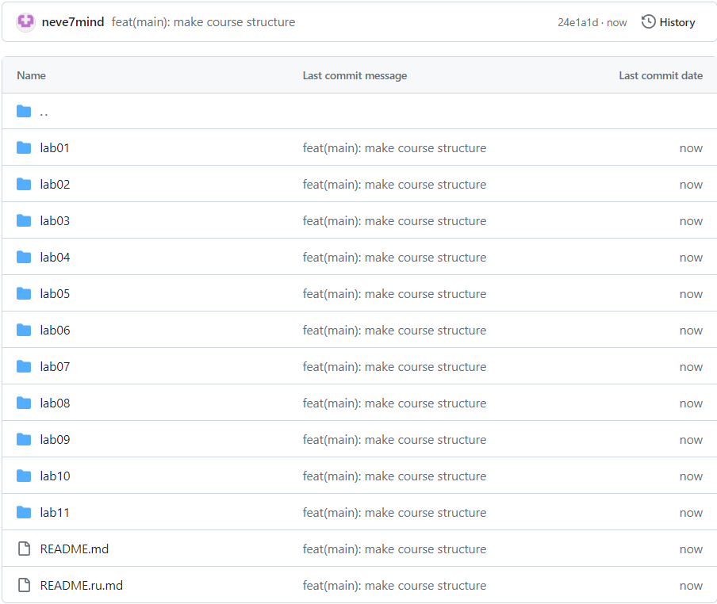{#fig:011 width=70%}

## Выполнение заданий для самостоятельной работы

1. Создаю отчёт по выполнению лабораторной работы в каталоге labs>lab02>report (рис. [-@fig:012]). Работать я буду в LibreOffice Writer. 

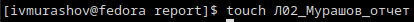{#fig:012 width=70%}

2. Копирую отчет по выполнению первой лабораторной работы в подкаталог report каталога lab01, перенося его из ОС Windows, в которой я работал над отчетом ранее, в OC Linux с помощью общей папки. Затем, проверяю наличие отчёта с помощью команды 'ls' (рис. [-@fig:013]).

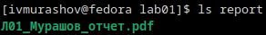{#fig:013 width=70%}

3. Загружаю файл Л01_Мурашов_отчет.pdf  на github с помощью следующих команд: 'git add' – для добавления файла, 'git commit -am 'feat(main): make course structure'' – для сохранения всех добавленных изменений и 'git push' – для отправки всех произведённых изменений в репозиторий (рис. [-@fig:014]). 

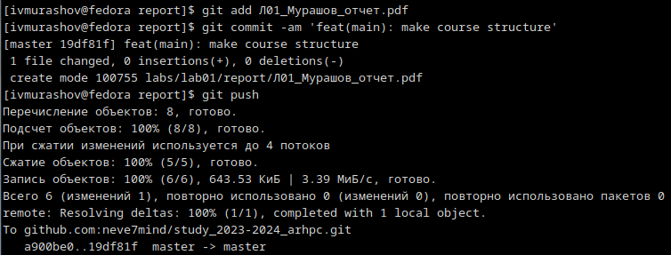{#fig:014 width=70%}

# Выводы

В ходе выполнения лабораторной работы я изучил идеологию и применение средств контроля версий, а также приобрел практические навыки по работе с системой git.

