---
## Front matter
title: "Лабораторная работа №3"
subtitle: "Архитектура компьютера"
author: "Мурашов Иван Вячеславович"

## Generic otions
lang: ru-RU
toc-title: "Содержание"

## Bibliography
bibliography: bib/cite.bib
csl: pandoc/csl/gost-r-7-0-5-2008-numeric.csl

## Pdf output format
toc: true # Table of contents
toc-depth: 2
lof: true # List of figures
lot: true # List of tables
fontsize: 12pt
linestretch: 1.5
papersize: a4
documentclass: scrreprt
## I18n polyglossia
polyglossia-lang:
  name: russian
  options:
	- spelling=modern
	- babelshorthands=true
polyglossia-otherlangs:
  name: english
## I18n babel
babel-lang: russian
babel-otherlangs: english
## Fonts
mainfont: PT Serif
romanfont: PT Serif
sansfont: PT Sans
monofont: PT Mono
mainfontoptions: Ligatures=TeX
romanfontoptions: Ligatures=TeX
sansfontoptions: Ligatures=TeX,Scale=MatchLowercase
monofontoptions: Scale=MatchLowercase,Scale=0.9
## Biblatex
biblatex: true
biblio-style: "gost-numeric"
biblatexoptions:
  - parentracker=true
  - backend=biber
  - hyperref=auto
  - language=auto
  - autolang=other*
  - citestyle=gost-numeric
## Pandoc-crossref LaTeX customization
figureTitle: "Рис."
tableTitle: "Таблица"
listingTitle: "Листинг"
lofTitle: "Список иллюстраций"
lotTitle: "Список таблиц"
lolTitle: "Листинги"
## Misc options
indent: true
header-includes:
  - \usepackage{indentfirst}
  - \usepackage{float} # keep figures where there are in the text
  - \floatplacement{figure}{H} # keep figures where there are in the text
---

# Цель работы

Целью лабораторной работы является освоение процедуры оформления отчетов с помощью легковесного языка разметки Markdown.

# Задание

Здесь приводится описание задания в соответствии с рекомендациями
методического пособия и выданным вариантом.??????????

# Теоретическое введение

Здесь описываются теоретические аспекты, связанные с выполнением работы. ?????????????????

# Выполнение лабораторной работы

## Заполнение отчёта по выполнению лабораторной работы №4 с помощью языка разметки Markdown

Открываю терминал, перехожу в каталог курса сформированный при выполнении лабораторной работы №2 и обновляю локальный репозиторий, скачав изменения из удаленного репозитория с помощью команды git pull (рис. [-@fig:001]).

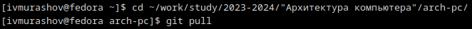{#fig:001 width=70%}

Перейдя в каталог с шаблоном отчета по лабораторной работе №3, провожу компиляцию шаблона с использованием Makefile с помощью команды make (рис. [-@fig:002]).

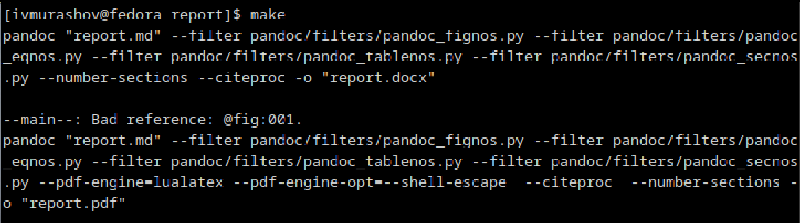{#fig:002 width=70%}

Проверяю наличие полученных ранее файлов report.pdf и report.docx с помощью утилиты ls (рис. [-@fig:003]).

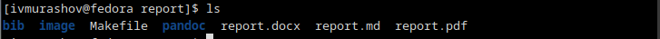{#fig:003 width=70%}

Удаляю полученные файлы с помощью команды make clean (рис. [-@fig:004]).

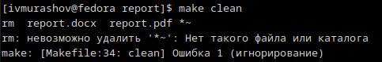{#fig:004 width=70%}

Проверяю, что файлы действительно были удалены, с помощью команды ls (рис. [-@fig:005]).

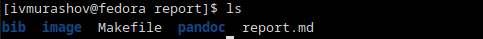{#fig:005 width=70%}

Открываю файл report.md c помощью текстового редактора gedit и изучаю его (рис. [-@fig:006]).

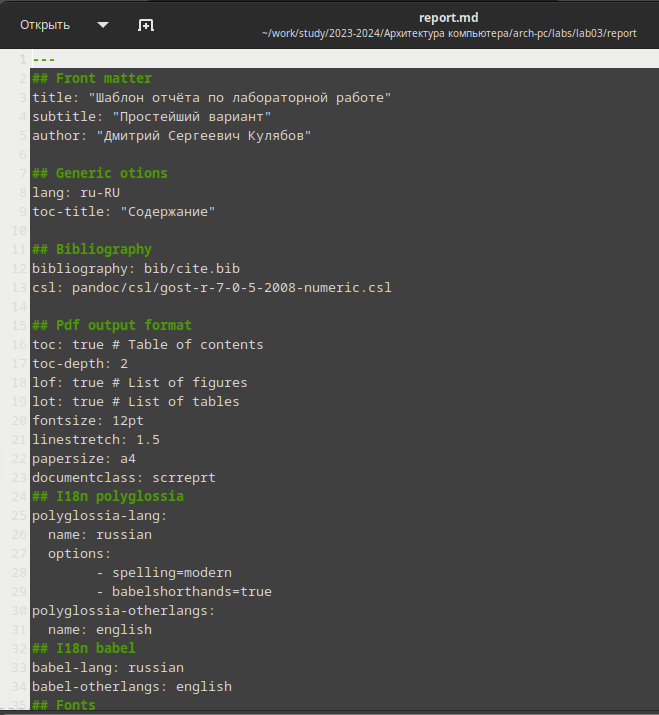{#fig:006 width=70%}

Начинаю заполнять отчёт с помощью языка разметки Markdown (рис. [-@fig:007]).

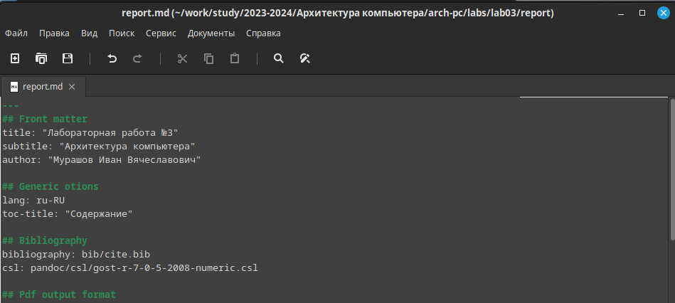{#fig:007 width=70%}

Компилирую отчёт и загружаю файлы на github.

## Задания для самостоятельной работы

1. Перехожу в каталог lab02/report, скопировав файл report.md с новым именем для формирования отчёта. Проверяю его наличие в текущем каталоге (рис. [-@fig:008]).

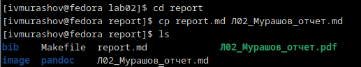{#fig:008 width=70%}

Начинаю заполнять отчёт в формате Markdown (рис. [-@fig:009])

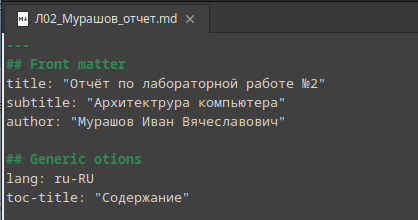{#fig:009 width=70%}

Удаляю файл с отчётом, выполненным ранее в формате pdf, и проверяю корректность удаления (рис. [-@fig:010]).

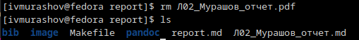{#fig:010 width=70%}

Компилирую файлы с отчётом по лабораторной работе №2 (рис. [-@fig:011])

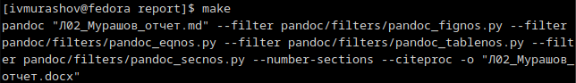{#fig:011 width=70%}

Проверяю наличие файлов Л02_Мурашов_отчет.docx и Л02_Мурашов_отчет.pdf (рис. [-@fig:012])

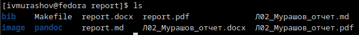{#fig:012 width=70%}

2. Удаляю лишние файлы report.pdf и report.docx, созданные по команде make (рис. [-@fig:013]).

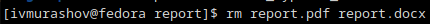{#fig:013 width=70%}

С помощью команды 'git add' добавляю изменения, с помощью команды 'git commit' сохраняю их и отправляю файлы на сервер с помощью команды 'git pull' (рис. [-@fig:014]).

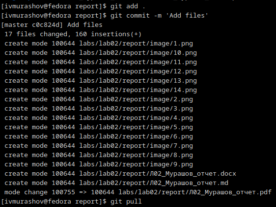{#fig:014 width=70%}

# Выводы

В результате выполнения данной лабораторной работы я освоил процедуры оформления отчетов с помощью легковесного языка разметки Markdown.

# Список литературы{.unnumbered}

::: {#refs}
