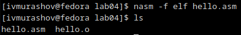

---
## Front matter
title: "Лабораторная работа №3"
subtitle: "Архитектура компьютера"
author: "Мурашов Иван Вячеславович"

## Generic otions
lang: ru-RU
toc-title: "Содержание"

## Bibliography
bibliography: bib/cite.bib
csl: pandoc/csl/gost-r-7-0-5-2008-numeric.csl

## Pdf output format
toc: true # Table of contents
toc-depth: 2
lof: true # List of figures
lot: true # List of tables
fontsize: 12pt
linestretch: 1.5
papersize: a4
documentclass: scrreprt
## I18n polyglossia
polyglossia-lang:
  name: russian
  options:
	- spelling=modern
	- babelshorthands=true
polyglossia-otherlangs:
  name: english
## I18n babel
babel-lang: russian
babel-otherlangs: english
## Fonts
mainfont: PT Serif
romanfont: PT Serif
sansfont: PT Sans
monofont: PT Mono
mainfontoptions: Ligatures=TeX
romanfontoptions: Ligatures=TeX
sansfontoptions: Ligatures=TeX,Scale=MatchLowercase
monofontoptions: Scale=MatchLowercase,Scale=0.9
## Biblatex
biblatex: true
biblio-style: "gost-numeric"
biblatexoptions:
  - parentracker=true
  - backend=biber
  - hyperref=auto
  - language=auto
  - autolang=other*
  - citestyle=gost-numeric
## Pandoc-crossref LaTeX customization
figureTitle: "Рис."
tableTitle: "Таблица"
listingTitle: "Листинг"
lofTitle: "Список иллюстраций"
lotTitle: "Список таблиц"
lolTitle: "Листинги"
## Misc options
indent: true
header-includes:
  - \usepackage{indentfirst}
  - \usepackage{float} # keep figures where there are in the text
  - \floatplacement{figure}{H} # keep figures where there are in the text
---

# Цель работы

Освоение процедуры компиляции и сборки программ, написанных на ассемблере NASM.

# Задание

Здесь приводится описание задания в соответствии с рекомендациями
методического пособия и выданным вариантом.

# Выполнение лабораторной работы

## Программа Hello world!

Создаю каталог для работы с программами на языке ассемблера NASM и перехожу в созданный каталог (рис. [-@fig:001]).

{#fig:001 width=70%}

Создаю текстовый файл с именем 'hello.asm' и открываю этот файл с помощью текстового редактора gedit (рис. [-@fig:002]).

{#fig:002 width=70%}

Ввожу приведённый в лекции текст в файл 'hello.asm' (рис. [-@fig:003])

{#fig:003 width=70%}

## Работа с транслятором NASM

Для компиляции текста программы "Hello World!" ввожу команду 'nasm -f elf hello.asm' и затем проверяю наличие скомпилированного файла 'hello.o' (рис. [-@fig:004])

{#fig:004 width=70%}

## Работа с расширенным синтаксисом командной строки NASM

Ввожу команду 'nasm -o obj.o -f elf -g -l list.lst hello.asm' для компиляции исходного файла 'hello.asm' в 'obj.o' и файла листинга 'list.lst'. Проверяю корректность созданных файлов (рис. [-@fig:005]).

{#fig:005 width=70%}

## Работа с компоновщиком LD

Передаю объектный файл на обработку компоновщику с помощью команды 'ld -m elf_i386 hello.o -o hello' и проверяю, что исполняемый файл 'hello' был создан (рис. [-@fig:006]).

{#fig:006 width=70%}

Выполняю команду 'ld -m elf_i386 obj.o -o main'. Исполняемый файл будет называться 'main', так как после ключа -о задано значение 'main'. Объектный файл, из которого собран этот исполняемый файл называется 'obj.o'. Просматриваю текущий каталог (рис. [-@fig:007]).

{#fig:007 width=70%}

## Запуск исполняемого файла

Запускаю на выполнение созданный исполняемый файл, набрав команду './hello' (рис. [-@fig:008]).

{#fig:008 width=70%}

## Задания для самостоятельной работы

1. В каталоге lab04 с помощью команды 'cp' создаю копию файла 'hello.asm' с именем 'lab4.asm'. Проверяю наличие скопированного файла (рис. [-@fig:009]).

{#fig:009 width=70%}

2. С помощью текстового редактора gedit вношу изменения в текст программы в файле lab4.asm так, чтобы вместо Hello world! на экран выводилась строка с моими фамилией и именем (рис. [-@fig:010]).

{#fig:010 width=70%}

3. Транслирую полученный текст программы lab4.asm в объектный файл. Проверяю наличие файла 'lab4.o' (рис. [-@fig:011]). 

{#fig:011 width=70%}

Выполняю компоновку объектного файла и проверяю наличие исполняемого файла 'lab4' (рис. [-@fig:012]).

{#fig:012 width=70%}

Запускаю получившийся исполняемый файл (рис. [-@fig:013]).

{#fig:013 width=70%}

4. Копирую файлы hello.asm и lab4.asm в мой локальный репозиторий в каталог ~/work/study/2023-2024/"Архитектура компьютера"/arch-pc/labs/lab04/ через файловую систему (рис. [-@fig:014]).

{#fig:014 width=70%}

Загружаю файлы на Github (рис. [-@fig:015]).

{#fig:015 width=70%}

# Выводы

Здесь кратко описываются итоги проделанной работы.

# Список литературы{.unnumbered}

::: {#refs}
