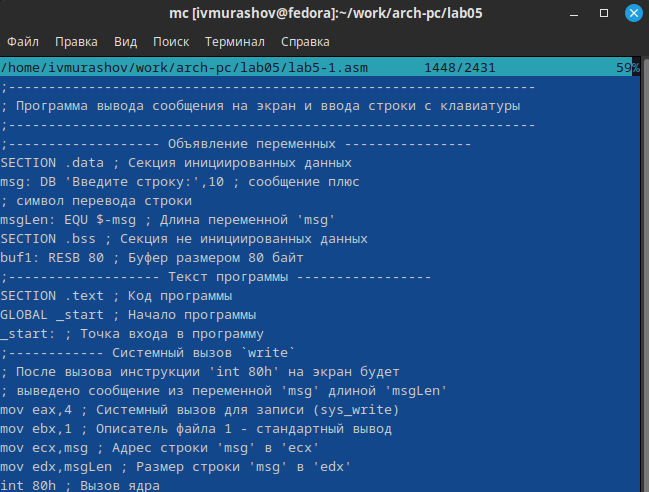
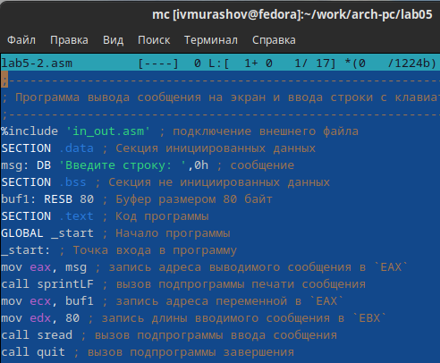
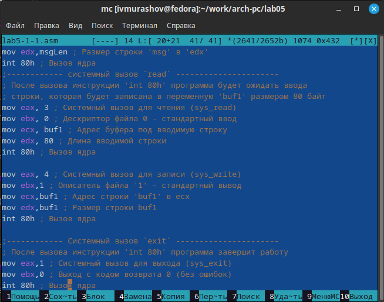

---
## Front matter
title: "Лабораторная работа №5"
subtitle: "Архитектура компьютера"
author: "Мурашов Иван Вячеславович"

## Generic otions
lang: ru-RU
toc-title: "Содержание"

## Bibliography
bibliography: bib/cite.bib
csl: pandoc/csl/gost-r-7-0-5-2008-numeric.csl

## Pdf output format
toc: true # Table of contents
toc-depth: 2
lof: true # List of figures
lot: true # List of tables
fontsize: 12pt
linestretch: 1.5
papersize: a4
documentclass: scrreprt
## I18n polyglossia
polyglossia-lang:
  name: russian
  options:
	- spelling=modern
	- babelshorthands=true
polyglossia-otherlangs:
  name: english
## I18n babel
babel-lang: russian
babel-otherlangs: english
## Fonts
mainfont: PT Serif
romanfont: PT Serif
sansfont: PT Sans
monofont: PT Mono
mainfontoptions: Ligatures=TeX
romanfontoptions: Ligatures=TeX
sansfontoptions: Ligatures=TeX,Scale=MatchLowercase
monofontoptions: Scale=MatchLowercase,Scale=0.9
## Biblatex
biblatex: true
biblio-style: "gost-numeric"
biblatexoptions:
  - parentracker=true
  - backend=biber
  - hyperref=auto
  - language=auto
  - autolang=other*
  - citestyle=gost-numeric
## Pandoc-crossref LaTeX customization
figureTitle: "Рис."
tableTitle: "Таблица"
listingTitle: "Листинг"
lofTitle: "Список иллюстраций"
lotTitle: "Список таблиц"
lolTitle: "Листинги"
## Misc options
indent: true
header-includes:
  - \usepackage{indentfirst}
  - \usepackage{float} # keep figures where there are in the text
  - \floatplacement{figure}{H} # keep figures where there are in the text
---

# Цель работы

Целью данной лабораторной работы является приобретение практических навыков работы в Midnight Commander и освоение инструкций языка ассемблера mov и int.

# Задание

1. Основы работы с Midnight Commander
2. Подключение внешнего файла in_out.asm
3. Выполнение заданий для самостоятельной работы

# Выполнение лабораторной работы

## Основы работы с Midnight Commander

Открываю Midnight Commander с помощью команды mc (рис. [-@fig:001]).

{#fig:001 width=70%}

Перехожу в каталог ~/work/arch-pc, созданный при выполнении лабораторной работы №4. С помощью функциональной клавиши F7 создаю папку lab05 и перехожу в созданный каталог (рис. [-@fig:002]).

{#fig:002 width=70%}

Пользуясь строкой ввода и командой touch, создаю файл lab5-1.asm (рис. [-@fig:003]). 

{#fig:003 width=70%}

С помощью функциональной клавиши F4 открываю файл lab5-1.asm для редактирования во встроенном редакторе mcedit. Вношу изменения, сохраняю и закрываю файл (рис. [-@fig:004]). 

{#fig:004 width=70%}

С помощью функциональной клавиши F3 открываю файл lab5-1.asm для просмотра и убеждаюсь в том, что файл содержит текст программы (рис. [-@fig:005]).

{#fig:005 width=70%}

Транслирую текст программы файла в объектный файл, компоную создавшийся объектный файл и запускаю исполняемый файл, вводя с клавиатуры свои ФИО (рис. [-@fig:006]).

{#fig:006 width=70%}

## Подключение внешнего файла in_out.asm

Скачиваю файл in_out.asm со страницы курса в ТУИС и с помощью фунциональной клавиши F5 копирую данный файл в каталог lab05, где находится файл lab5-1.asm (рис. [-@fig:007]).

{#fig:007 width=70%}

С помощью функциональной клавиши F6 создаю копию файла lab5-1.asm с именем lab5-2.asm (рис. [-@fig:008]).

{#fig:008 width=70%}

Исправляю текст программы в файле lab5-2.asm с использование подпрограмм из внешнего файла in_out.asm, используя подпрограммы sprintLF, sread и quit (рис. [-@fig:009]).

{#fig:009 width=70%}

Создаю исполняемый файл и проверяю корректность его работы (рис. [-@fig:010]).

{#fig:010 width=70%}

В файле lab5-2.asm заменяю подпрограмму sprintLF на sprint (рис. [-@fig:011]).

{#fig:011 width=70%}

Создаю исполняемый файл и проверяю его работу (рис. [-@fig:012]).

{#fig:012 width=70%}

Разница между двумя последними исполняемыми файлами в том, что первая программа запрашивает ввод с новой строки в то время как вторая программа запрашивет ввод без переноса, так как sprintLF подразумевает переход на новую строку, а sprint - нет.

## Выполнение заданий для самостоятельной работы

1. Создаю копию файла lab5-1.asm, называя её lab5-1-1.asm с помощью функциональной клавиши F5 (рис. [-@fig:013]).

{#fig:013 width=70%}

С помощью функциональной клавиши F4 вношу изменения в программу без использования внешнего файла in_out.asm так, чтобы она выводила приглашение типа "Введите строку:", с клавиатуры осуществлялся ввод строки и производился вывод введённой строки на экран (рис. [-@fig:014]).

{#fig:014 width=70%}

2. Создаю исполняемый файл и проверяю корректность его работы (рис. [-@fig:015]).

{#fig:015 width=70%}

3. Создаю копию файла lab5-2.asm, называя её lab5-2-2.asm с помощью функциональной клавиши F5 (рис. [-@fig:016]).

{#fig:016 width=70%}

С помощью функциональной клавиши F4 вношу изменения в программу с использованием внешнего файла in_out.asm так, чтобы она выводила приглашение типа "Введите строку:", с клавиатуры осуществлялся ввод строки и производился вывод введённой строки на экран (рис. [-@fig:017]).

{#fig:017 width=70%}

4. Создаю исполняемый файл и проверяю корректность его работы (рис. [-@fig:018]).

{#fig:018 width=70%}

# Выводы

В ходе выполнения данной лабораторной работы я приобрёл практические навыки работы в Midnight Commander и освоил инструкции языка ассемблера mov и int.

