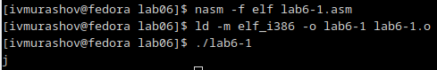
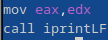
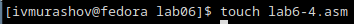

---
## Front matter
title: "Лабораторная работа №6"
subtitle: "Архитектура компьютера"
author: "Мурашов Иван Вячеславович"

## Generic otions
lang: ru-RU
toc-title: "Содержание"

## Bibliography
bibliography: bib/cite.bib
csl: pandoc/csl/gost-r-7-0-5-2008-numeric.csl

## Pdf output format
toc: true # Table of contents
toc-depth: 2
lof: true # List of figures
lot: true # List of tables
fontsize: 12pt
linestretch: 1.5
papersize: a4
documentclass: scrreprt
## I18n polyglossia
polyglossia-lang:
  name: russian
  options:
	- spelling=modern
	- babelshorthands=true
polyglossia-otherlangs:
  name: english
## I18n babel
babel-lang: russian
babel-otherlangs: english
## Fonts
mainfont: PT Serif
romanfont: PT Serif
sansfont: PT Sans
monofont: PT Mono
mainfontoptions: Ligatures=TeX
romanfontoptions: Ligatures=TeX
sansfontoptions: Ligatures=TeX,Scale=MatchLowercase
monofontoptions: Scale=MatchLowercase,Scale=0.9
## Biblatex
biblatex: true
biblio-style: "gost-numeric"
biblatexoptions:
  - parentracker=true
  - backend=biber
  - hyperref=auto
  - language=auto
  - autolang=other*
  - citestyle=gost-numeric
## Pandoc-crossref LaTeX customization
figureTitle: "Рис."
tableTitle: "Таблица"
listingTitle: "Листинг"
lofTitle: "Список иллюстраций"
lotTitle: "Список таблиц"
lolTitle: "Листинги"
## Misc options
indent: true
header-includes:
  - \usepackage{indentfirst}
  - \usepackage{float} # keep figures where there are in the text
  - \floatplacement{figure}{H} # keep figures where there are in the text
---

# Цель работы

Целью данной лабораторной работы является освоение арифметических инструкций языка ассемблера NASM.

# Задание

1. Символьные и численные данные в NASM

2. Выполнение арифметических операций в NASM

3. Выполнение заданий для самостоятельной работы

# Выполнение лабораторной работы

## Символьные и численные данные в NASM

Создаю каталог для программ лабораторной работы №6, перехожу в него и создаю файл lab6-1.asm (рис. [-@fig:001]).

{#fig:001 width=70%}

Открываю файл lab6-1.asm для редактирования в mcedit. Ввожу в файл текст программы из листинга 6.1 (рис. [-@fig:002]).

{#fig:002 width=70%}

Создаю исполняемый файл и запускаю его. Вывод программы: символ j, так как программа вывела символ, соответствующий сумме двоичных кодов символов 4 и 6 по системе ASCII  (рис. [-@fig:003]).

{#fig:003 width=70%}

Изменяю текст программы, записав в регистры числа вместо символов. (рис. [-@fig:004]).

{#fig:004 width=70%}

Создаю исполняемый файл и запускаю его. В данном случае выводится символ с кодом 10, которое соответствует символу "LF,|n" по таблице ASCII. Символ не отображается при выводе на экран, так как является символом перевода строки (рис. [-@fig:005]).

{#fig:005 width=70%}

Создаю файл lab6-2.asm в каталоге ~/work/arch-pc/lab06 (рис. [-@fig:006]).

{#fig:006 width=70%}

Ввожу в данный файл текст программы из листинга 6.2 (рис. [-@fig:007]).

{#fig:007 width=70%}

Создаю исполняемый файл и запускаю его. В результате работы программы я получаю число 106. В отличии от программы из листинга 6.1, функция iprintLF позволяет вывести число, а не символ, кодом которого является это число (рис. [-@fig:008]).

{#8fig:008 width=70%}

Изменяю текст программы, записав в регистры числа вместо символов. (рис. [-@fig:009]).

{#fig:009 width=70%}

Создаю исполняемый файл и запускаю его. В результате выводится число 10, так как программа складывает не коды в системе ASCII, а сами числа (рис. [-@fig:010]).

{#fig:010 width=70%}

Заменяю функцию iprintLF на iprint (рис. [-@fig:011]).

{#fig:011 width=70%}

Создаю исполняемый файл и запускаю его. Вывод функций iprintLF и iprint отличается тем, что в последнем случае не происходит перехода на новую строку при выводе значения (рис. [-@fig:012]).

{#fig:012 width=70%}

##  Выполнение арифметических операций в NASM

Создаю файл lab6-3.asm в каталоге ~/work/arch-pc/lab06 (рис. [-@fig:013]).

{#fig:013 width=70%}

Ввожу в файл текст программы из листинга 6.3 (рис. [-@fig:014]).

{#fig:014 width=70%}

Создаю исполняемый файл и запускаю его (рис. [-@fig:015]).

{#fig:015 width=70%}

Изменяю текст программы для вычисления выражения f(x) = (4 * 6 + 2)/5 (рис. [-@fig:016]).

{#fig:016 width=70%}

Создаю исполняемый файл и запускаю его. При самостоятельном расчёте результат совпал с ранее полученным выводом (рис. [-@fig:017]).

{#fig:017 width=70%}

Создаю файл variant.asm в каталоге ~/work/arch-pc/lab06 (рис. [-@fig:018]).

{#fig:018 width=70%}

Ввожу в файл текст программы из листинга 6.4 (рис. [-@fig:019]).

{#fig:019 width=70%}

Создаю исполняемый файл и запускаю его. Проверяю результат работы программы, вычислив номер своего варианта аналитически. Результаты совпали (рис. [-@fig:020]).

{#fig:020 width=70%}

### Ответы на вопросы по программе

1. За вывод на экран сообщения ‘Ваш вариант:’ отвечают следующие строки:

{#fig:021 width=70%}

2. Данные инструкции используются для того, чтобы поместить адрес вводимой строки в регистр ecx и записать в регистр edx длину вводимой строки (80 bytes). Затем мы вызываем подпрограмму из внешнего файла in_out.asm для ввода значения x с клавиатуры.

3. Инструкция 'call atoi' используется для перевода ASCII-код символа в целое число.

4. Зы вычисление варианта отвечают следующие строки листинга 6.4:

{#fig:022 width=70%}

5. Остаток от деления при выполнении инструкции 'div ebx' записывается в регистр edx.

6. Инструкция 'inc edx' используется для прибавления 1 к значению, записанному в регистре edx.

7. За вывод на экран результата вычислений отвечают следующие строки листинга 6.4:

{#fig:023 width=70%}

## Выполнение заданий для самостоятельной работы

Создаю файл lab6-4.asm в каталоге ~/work/arch-pc/lab06 (рис. [-@fig:024]).

{#fig:024 width=70%}

Открываю созданный файл с помощью редактора mc для редактирования и ввожу в него текст программы для вычисления выражения (((1/3)*x + 5) * 7) (19 вариант) (рис. [-@fig:025]).

{#fig:025 width=70%}

Создаю исполняемый файл и запускаю его. Проверяю корректность работы программы, вычислив получаемые значения вручную. Результаты совпали (рис. [-@fig:026]).

{#fig:026 width=70%}

**Листинг 4. Программа для вычисления значения выражения (((1/3)*x + 5) * 7)**

```NASM
%include 'in_out.asm' ; подключение внешнего файла
SECTION .data
    msg_str: 
        DB 'Введите значение переменной: ',0
    res_str:
        DB 'Результат: ',0
SECTION .bss
    x:
        RESB 16 ; Задаём переменную x
SECTION .text
GLOBAL _start
_start:
; ---- Вычисление выражения
    mov eax, msg_str ; string addr
    call sprintLF    ; print string

    mov edx, 15      ; buffer size
    mov ecx, x       ; buffer addr
    call sread       ; read string from stdin to buffer

    mov eax,x        ; string addr
    call atoi        ; convert to integer
    
    xor edx, edx     ; move edx, 0 (обнуление)
    mov ebx, 3
    div ebx          ; div eax, ebx ( by 3 )

    add eax, 5       ; plus 5

    mov ebx, 7       ;
    mul ebx          ; mul eax, ebx (7)
    mov edi, eax     ; save eax to edi

; ---- Вывод результата на экран
    mov eax, res_str ; 
    call sprint      ; print 'Результат: '
    mov eax, edi     ; restore eax
    call iprintLF    ; print eax as string
    call quit        ; exit
```

# Выводы

В ходе выполнения данной лабораторной работы я освоил арифметические инструкции языка ассемблера NASM.

