---
## Front matter
title: "Лабораторная работа №7"
subtitle: "Архитектура компьютера"
author: "Мурашов Иван Вячеславович"

## Generic otions
lang: ru-RU
toc-title: "Содержание"

## Bibliography
bibliography: bib/cite.bib
csl: pandoc/csl/gost-r-7-0-5-2008-numeric.csl

## Pdf output format
toc: true # Table of contents
toc-depth: 2
lof: true # List of figures
lot: true # List of tables
fontsize: 12pt
linestretch: 1.5
papersize: a4
documentclass: scrreprt
## I18n polyglossia
polyglossia-lang:
  name: russian
  options:
	- spelling=modern
	- babelshorthands=true
polyglossia-otherlangs:
  name: english
## I18n babel
babel-lang: russian
babel-otherlangs: english
## Fonts
mainfont: PT Serif
romanfont: PT Serif
sansfont: PT Sans
monofont: PT Mono
mainfontoptions: Ligatures=TeX
romanfontoptions: Ligatures=TeX
sansfontoptions: Ligatures=TeX,Scale=MatchLowercase
monofontoptions: Scale=MatchLowercase,Scale=0.9
## Biblatex
biblatex: true
biblio-style: "gost-numeric"
biblatexoptions:
  - parentracker=true
  - backend=biber
  - hyperref=auto
  - language=auto
  - autolang=other*
  - citestyle=gost-numeric
## Pandoc-crossref LaTeX customization
figureTitle: "Рис."
tableTitle: "Таблица"
listingTitle: "Листинг"
lofTitle: "Список иллюстраций"
lotTitle: "Список таблиц"
lolTitle: "Листинги"
## Misc options
indent: true
header-includes:
  - \usepackage{indentfirst}
  - \usepackage{float} # keep figures where there are in the text
  - \floatplacement{figure}{H} # keep figures where there are in the text
---

# Цель работы

Целью данной лабораторной работы является изучение команд условного и безусловного переходов, приобретение навыков написания программ с использованием переходов и знакомство с назначением и структурой файла листинга.

# Задание

Здесь приводится описание задания в соответствии с рекомендациями
методического пособия и выданным вариантом.

# Выполнение лабораторной работы

## Реализация переходов в NASM

Создаю каталог для программам лабораторной работы №7, перехожу в него и создаю файл lab7-1.asm (рис. [-@fig:001]).

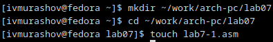{#fig:001 width=70%}

Ввожу в файл lab7-1.asm текст программы из листинга 7.1 (рис. [-@fig:002]).

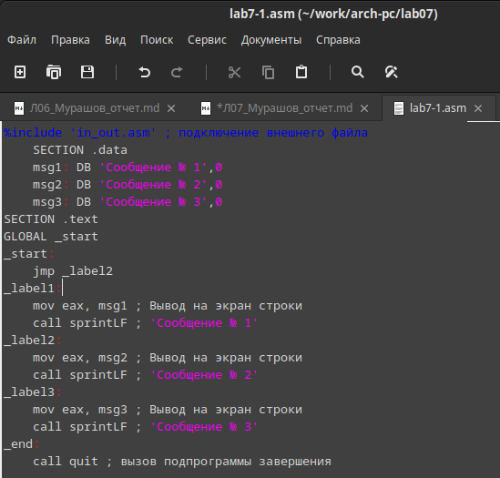{#fig:002 width=70%}

**Листинг 1. Программа с использованием инструкции jmp**

```NASM
%include 'in_out.asm' ; подключение внешнего файла
SECTION .data
msg1: DB 'Сообщение № 1',0
msg2: DB 'Сообщение № 2',0
msg3: DB 'Сообщение № 3',0
SECTION .text
GLOBAL _start
_start:
jmp _label2
_label1:
mov eax, msg1 ; Вывод на экран строки
call sprintLF ; 'Сообщение № 1'
_label2:
mov eax, msg2 ; Вывод на экран строки
call sprintLF ; 'Сообщение № 2'
_label3:
mov eax, msg3 ; Вывод на экран строки
call sprintLF ; 'Сообщение № 3'
_end:
call quit ; вызов подпрограммы завершения
```

Создаю исполняемый файл и запускаю его (рис. [-@fig:003]).

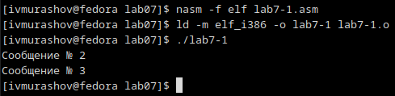{#fig:003 width=70%}

Изменяю программу таким образом, чтобы она выводила сначала 'Сообщение № 2', потом 'Сообщение № 1' и завершала работу. Для этого в текст программы после вывода сообщения №2 добавляю инструкцию jmp с меткой _label1 (т.е. переход к инструкциям вывода сообщения №1) и после вывода сообщения №1 добавляю инструкцию jmp с меткой _end (т.е. переход к инструкции call quit). Изменяю текст программы в соответствии с листингом 7.2 (рис. [-@fig:004]).

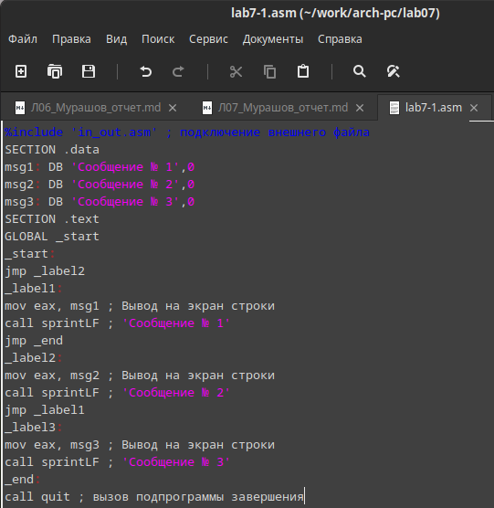{#fig:004 width=70%}

**Листинг 2. Программа с использованием инструкции jmp**

```NASM
%include 'in_out.asm' ; подключение внешнего файла
SECTION .data
msg1: DB 'Сообщение № 1',0
msg2: DB 'Сообщение № 2',0
msg3: DB 'Сообщение № 3',0
SECTION .text
GLOBAL _start
_start:
jmp _label2
_label1:
mov eax, msg1 ; Вывод на экран строки
call sprintLF ; 'Сообщение № 1'
jmp _end
_label2:
mov eax, msg2 ; Вывод на экран строки
call sprintLF ; 'Сообщение № 2'
jmp _label1
_label3:
mov eax, msg3 ; Вывод на экран строки
call sprintLF ; 'Сообщение № 3'
_end:
call quit ; вызов подпрограммы завершения
```

Создаю исполняемый файл и запускаю его (рис. [-@fig:005]).

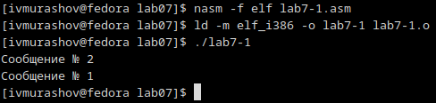{#fig:005 width=70%}

Изменяю текст программы так, чтобы программа сначала выводила 'Сообщение № 3', затем 'Сообщение № 2', а затем 'Сообщение № 1' (рис. [-@fig:006]).

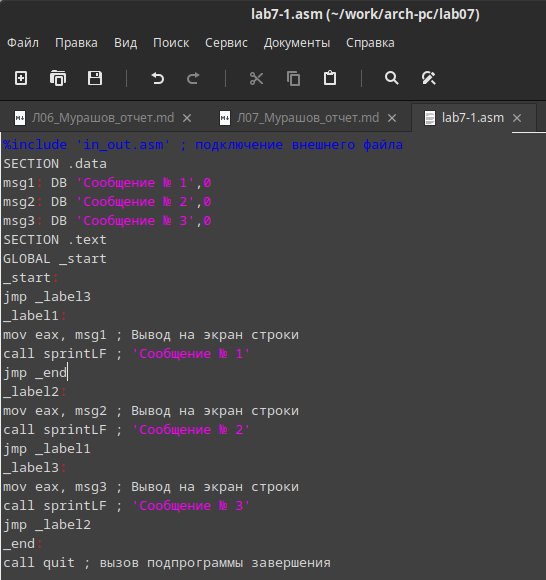{#fig:006 width=70%}

**Листинг 3. Программа с использованием инструкции jmp**

```NASM
%include 'in_out.asm' ; подключение внешнего файла
SECTION .data
msg1: DB 'Сообщение № 1',0
msg2: DB 'Сообщение № 2',0
msg3: DB 'Сообщение № 3',0
SECTION .text
GLOBAL _start
_start:
jmp _label3
_label1:
mov eax, msg1 ; Вывод на экран строки
call sprintLF ; 'Сообщение № 1'
jmp _end
_label2:
mov eax, msg2 ; Вывод на экран строки
call sprintLF ; 'Сообщение № 2'
jmp _label1
_label3:
mov eax, msg3 ; Вывод на экран строки
call sprintLF ; 'Сообщение № 3'
jmp _label2
_end:
call quit ; вызов подпрограммы завершения
```

Создаю исполняемый файл и запускаю его (рис. [-@fig:007]).

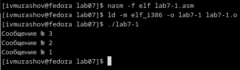{#fig:007 width=70%}

Создаю файл lab7-2.asm (рис. [-@fig:008]).

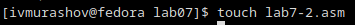{#fig:008 width=70%}

Изучаю текст программы из листинга 7.3 и ввожу в lab7-2.asm (рис. [-@fig:009]).

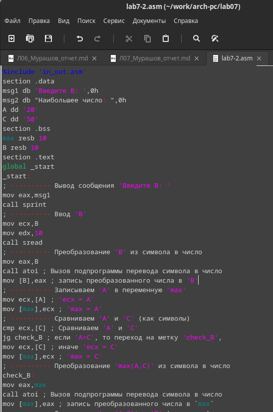{#fig:009 width=70%}

**Листинг 3. Программа, которая определяет и выводит на экран наибольшую из 3 целочисленных переменных: A, B и C**

```NASM
%include 'in_out.asm'
section .data
msg1 db 'Введите B: ',0h
msg2 db "Наибольшее число: ",0h
A dd '20'
C dd '50'
section .bss
max resb 10
B resb 10
section .text
global _start
_start:
; ---------- Вывод сообщения 'Введите B: '
mov eax,msg1
call sprint
; ---------- Ввод 'B'
mov ecx,B
mov edx,10
call sread
; ---------- Преобразование 'B' из символа в число
mov eax,B
call atoi ; Вызов подпрограммы перевода символа в число
mov [B],eax ; запись преобразованного числа в 'B'
; ---------- Записываем 'A' в переменную 'max'
mov ecx,[A] ; 'ecx = A'
mov [max],ecx ; 'max = A'
; ---------- Сравниваем 'A' и 'С' (как символы)
cmp ecx,[C] ; Сравниваем 'A' и 'С'
jg check_B ; если 'A>C', то переход на метку 'check_B',
mov ecx,[C] ; иначе 'ecx = C'
mov [max],ecx ; 'max = C'
; ---------- Преобразование 'max(A,C)' из символа в число
check_B:
mov eax,max
call atoi ; Вызов подпрограммы перевода символа в число
mov [max],eax ; запись преобразованного числа в `max`
; ---------- Сравниваем 'max(A,C)' и 'B' (как числа)
mov ecx,[max]
cmp ecx,[B] ; Сравниваем 'max(A,C)' и 'B'
jg fin ; если 'max(A,C)>B', то переход на 'fin',
mov ecx,[B] ; иначе 'ecx = B'
mov [max],ecx
; ---------- Вывод результата
fin:
mov eax, msg2
call sprint ; Вывод сообщения 'Наибольшее число: '
mov eax,[max]
call iprintLF ; Вывод 'max(A,B,C)'
call quit ; Выход
```

Создаю исполняемый файл и запускаю его и проверяю его работу для разных значений B.(рис. [-@fig:010]).

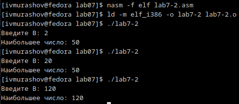{#fig:010 width=70%}

##  Изучение структуры файла листинга

Создаю файл листинга для программы из файла lab7-2.asm о, указав ключ -l и задав имя файла листинга в командной строке (рис. [-@fig:011]).

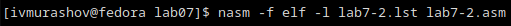{#fig:011 width=70%}

Открываю файл листинга lab7-2.lst (рис. [-@fig:012]).

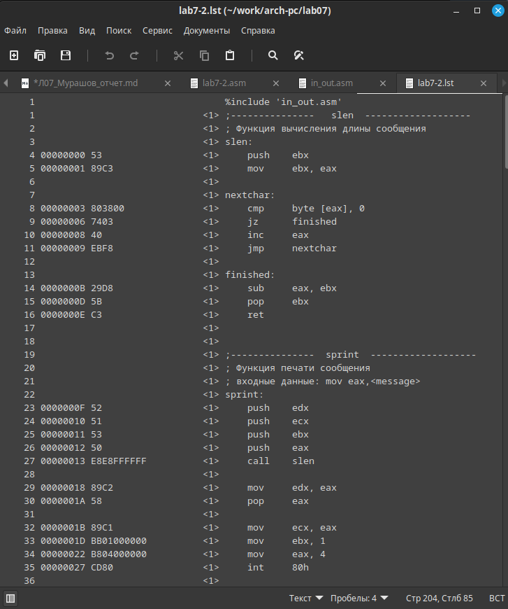{#fig:012 width=70%}

Объясняю содержимое первой выбранной строки: 

```NASM
5 00000035 32300000                A dd '20'
```

5 - номер строки; 00000035 - смещение машинного кода от начала текущего сегмента; инструкция A dd '20' ассемблируется в 32300000 (в шестнадцатеричном представлении); 32300000 - инструкция на машинном языке, определяющая переменную A размером в 4 байта); A dd '20' - исходный текст программы.

Объясняю содержимое второй выбранной строки: 

```NASM
21 00000101 B8[0A000000]            mov eax,B
```

21 - номер строки; 00000101 - смещение машинного кода от начала текущего сегмента; инструкция mov eax,B ассемблируется в B8[0A000000] (в шестнадцатеричном представлении); B8[0A000000] - инструкция на машинном языке, записывающая значение переменной B в регистр eax); mov eax,B - исходный текст программы.

Объясняю содержимое третьей выбранной строки: 

```NASM
29 00000122 7F0C                    jg check_B
```

29 - номер строки; 00000122 - смещение машинного кода от начала текущего сегмента; инструкция jg check_B ассемблируется в 7F0C (в шестнадцатеричном представлении); 7F0C - инструкция на машинном языке, осуществляющая переход на метку 'check_B', если A>C); jg check_B - исходный текст программы.

Открываю файл с программой lab7-2.asm и в разделе сравнения 'A' и 'C' как символов удаляю операнд [C] (рис. [-@fig:013]).

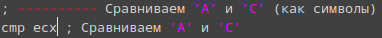{#fig:013 width=70%}

Выполняю трансляцию с получением файла листинга (рис. [-@fig:014]).

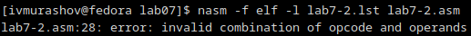{#fig:014 width=70%}

На выходе я не получаю никаких файлов, так как инструкция cmp подразумевает сравнение двух операндов.

## Выполнение заданий для самостоятельной работы

1. Создаю файл lab7-3.asm в каталоге lab07 (рис. [-@fig:015]).

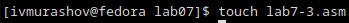{#fig:015 width=70%}

Открываю файл и пишу программу нахождения наименьшей из 3 целочисленных переменных a, b и c. В соответствии с таблицей 7.5 присваиваю переменным значения, указанные в 19 варианте (рис. [-@fig:016]).

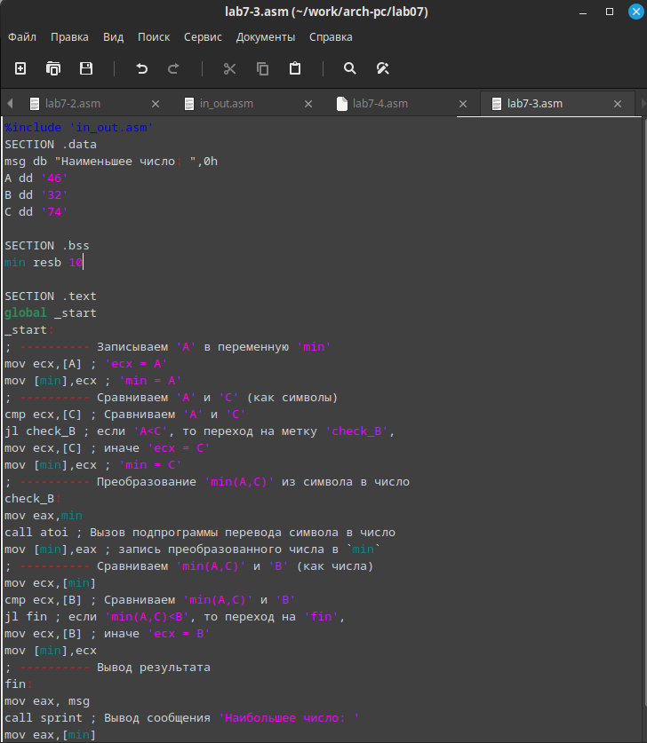{#fig:016 width=70%}

**Листинг 4. Программа нахождения наименьшей из 3 целочисленных переменных a, b и c**

```NASM
%include 'in_out.asm'
SECTION .data
msg db "Наименьшее число: ",0h
A dd '46'
B dd '32'
C dd '74'

SECTION .bss
min resb 10

SECTION .text
global _start
_start:
; ---------- Записываем 'A' в переменную 'min'
mov ecx,[A] ; 'ecx = A'
mov [min],ecx ; 'min = A'
; ---------- Сравниваем 'A' и 'С' (как символы)
cmp ecx,[C] ; Сравниваем 'A' и 'С'
jl check_B ; если 'A<C', то переход на метку 'check_B',
mov ecx,[C] ; иначе 'ecx = C'
mov [min],ecx ; 'min = C'
; ---------- Преобразование 'min(A,C)' из символа в число
check_B:
mov eax,min
call atoi ; Вызов подпрограммы перевода символа в число
mov [min],eax ; запись преобразованного числа в `min`
; ---------- Сравниваем 'min(A,C)' и 'B' (как числа)
mov ecx,[min]
cmp ecx,[B] ; Сравниваем 'min(A,C)' и 'B'
jl fin ; если 'min(A,C)<B', то переход на 'fin',
mov ecx,[B] ; иначе 'ecx = B'
mov [min],ecx
; ---------- Вывод результата
fin:
mov eax, msg
call sprint ; Вывод сообщения 'Наибольшее число: '
mov eax,[min]
call iprintLF ; Вывод 'min(A,B,C)'
call quit ; Выход
```

Создаю исполняемый файл и запускаю его (рис. [-@fig:017]).

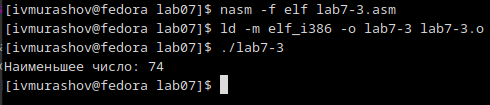{#fig:017 width=70%}

Программа работает корректно. 74 - действительно, наибольшее из данных чисел.

2. Создаю файл lab7-4.asm в каталоге lab07 (рис. [-@fig:018]).

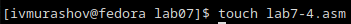{#fig:018 width=70%}

Открываю файл и пишу программу, которая для введенных с клавиатуры значений x и a вычисляет значение заданной функции f(x) и выводит результат вычислений. В соответствии с таблицей 7.6 (19 вариант), f(x) = {a + x, x>a;  x, x<=a (рис. [-@fig:019]).

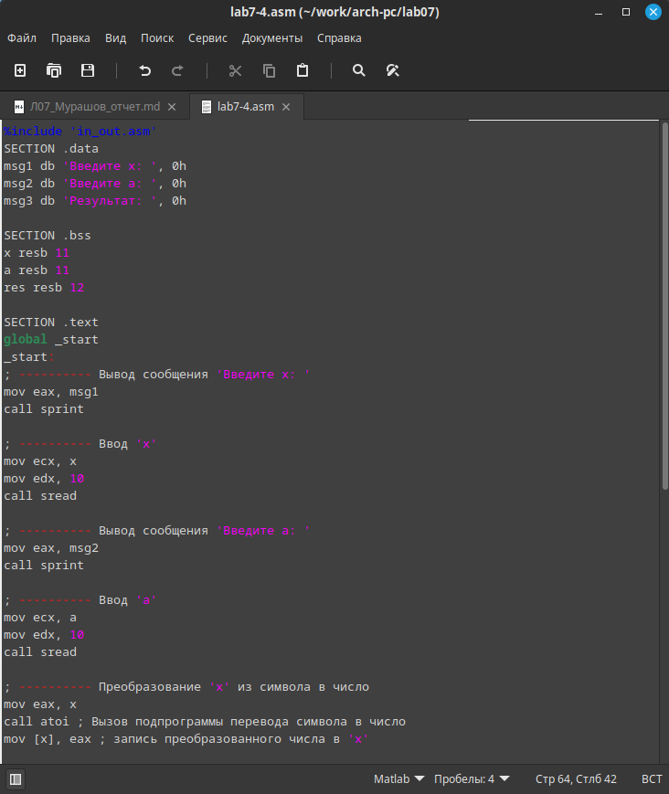{#fig:019 width=70%}

Создаю исполняемый файл и запускаю его. Проверяю его работу для значений x и a из таблицы 7.6 (рис. [-@fig:020]).

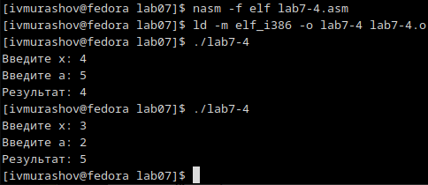{#fig:020 width=70%}

**Листинг 5. Программа для вычисления значения заданной фунцкии f(x)**

```NASM
%include 'in_out.asm'
SECTION .data
msg1 db 'Введите x: ', 0h
msg2 db 'Введите a: ', 0h
msg3 db 'Результат: ', 0h

SECTION .bss
x resb 11
a resb 11
res resb 12

SECTION .text
global _start
_start:
; ---------- Вывод сообщения 'Введите x: '
mov eax, msg1
call sprint

; ---------- Ввод 'x'
mov ecx, x
mov edx, 10
call sread

; ---------- Вывод сообщения 'Введите a: '
mov eax, msg2
call sprint

; ---------- Ввод 'a'
mov ecx, a
mov edx, 10
call sread

; ---------- Преобразование 'x' из символа в число
mov eax, x
call atoi ; Вызов подпрограммы перевода символа в число
mov [x], eax ; запись преобразованного числа в 'x'
 
; ---------- Преобразование 'a' из символа в число
mov eax, a
call atoi ; Вызов подпрограммы перевода символа в число
mov [a], eax ; запись преобразованного числа в 'a'

; ---------- Сравниваем 'x' и 'a' (как числа)
mov eax, [a]
mov ecx, [x]
cmp eax, ecx ; Сравниваем 'a' и 'x'
jl add_xa ; если 'a<x', то переход на метку 'add_xa'
mov eax, ecx ; иначе 'eax = x'
mov [res], eax ; 'res = x'
jmp _res

; ---------- Записываем 'a+x' в переменную 'res'
add_xa:
add eax, ecx ; 'eax = eax + ecx = a + x' 
mov [res], eax ; 'res = a + x'
;jmp _res

; ---------- Вывод результата
_res:
mov eax, msg3
call sprint ; Вывод сообщения 'Результат: '
mov eax, [res]
call iprintLF ; Вывод
call quit ; Вызов подпрограммы завершения
```

# Выводы

В ходе выполнения данной лабораторной работы я изучил команды условного и безусловного переходов, приобрёл навыки написания программ с использованием переходов и познкомился с назначением и структурой файла листинга.

