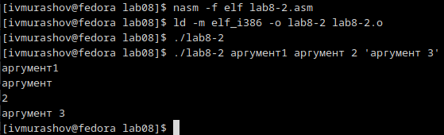
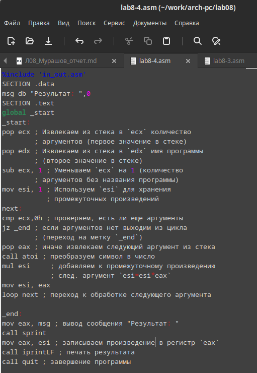

---
## Front matter
title: "Лабораторная работа №8"
subtitle: "Архитектура компьютера"
author: "Мурашов Иван Вячеславович"

## Generic otions
lang: ru-RU
toc-title: "Содержание"

## Bibliography
bibliography: bib/cite.bib
csl: pandoc/csl/gost-r-7-0-5-2008-numeric.csl

## Pdf output format
toc: true # Table of contents
toc-depth: 2
lof: true # List of figures
lot: true # List of tables
fontsize: 12pt
linestretch: 1.5
papersize: a4
documentclass: scrreprt
## I18n polyglossia
polyglossia-lang:
  name: russian
  options:
	- spelling=modern
	- babelshorthands=true
polyglossia-otherlangs:
  name: english
## I18n babel
babel-lang: russian
babel-otherlangs: english
## Fonts
mainfont: PT Serif
romanfont: PT Serif
sansfont: PT Sans
monofont: PT Mono
mainfontoptions: Ligatures=TeX
romanfontoptions: Ligatures=TeX
sansfontoptions: Ligatures=TeX,Scale=MatchLowercase
monofontoptions: Scale=MatchLowercase,Scale=0.9
## Biblatex
biblatex: true
biblio-style: "gost-numeric"
biblatexoptions:
  - parentracker=true
  - backend=biber
  - hyperref=auto
  - language=auto
  - autolang=other*
  - citestyle=gost-numeric
## Pandoc-crossref LaTeX customization
figureTitle: "Рис."
tableTitle: "Таблица"
listingTitle: "Листинг"
lofTitle: "Список иллюстраций"
lotTitle: "Список таблиц"
lolTitle: "Листинги"
## Misc options
indent: true
header-includes:
  - \usepackage{indentfirst}
  - \usepackage{float} # keep figures where there are in the text
  - \floatplacement{figure}{H} # keep figures where there are in the text
---

# Цель работы

Целью данной лабораторной работы является приобретение навыков написания программ с использованием циклов и обработкой аргументов командной строки.

# Задание

1. Реализация циклов в NASM
2. Обработка аргументов командной строки
3. Выполнение заданий для самостоятельной работы 

# Выполнение лабораторной работы

## Реализация циклов в NASM

Создаю каталог для программам лабораторной работы №8, перехожу в него и создаю файл lab8-1.asm (рис. [-@fig:001]).

{#fig:001 width=70%}

Ввожу в файл lab8-1.asm текст программы из листинга 8.1 (рис. [-@fig:002]).

{#fig:002 width=70%}

**Листинг 1. Программа вывода значений регистра ecx**

```NASM
;-----------------------------------------------------------------
; Программа вывода значений регистра 'ecx'
;-----------------------------------------------------------------
%include 'in_out.asm'
SECTION .data
msg1 db 'Введите N: ',0h

SECTION .bss
N: resb 10
SECTION .text
global _start
_start:
; ----- Вывод сообщения 'Введите N: '
mov eax,msg1
call sprint

; ----- Ввод 'N'
mov ecx, N
mov edx, 10
call sread

; ----- Преобразование 'N' из символа в число
mov eax,N
call atoi
mov [N],eax

; ------ Организация цикла
mov ecx,[N] ; Счетчик цикла, `ecx=N`
label:
mov [N],ecx
mov eax,[N]
call iprintLF ; Вывод значения `N`
loop label ; `ecx=ecx-1` и если `ecx` не '0' ; переход на `label`
call quit
```

Создаю исполняемый файл и запускаю его (рис. [-@fig:003]).

{#fig:003 width=70%}

Данная программа выводит все числа от N до 1 включительно. Изменяю текст программы, добавив изменение значения регистра ecx в цикле: (рис. [-@fig:004]).

```NASM
label:
sub ecx,1 ; `ecx=ecx-1`
mov [N],ecx
mov eax,[N]
call iprintLF
loop label
```

{#fig:004 width=70%}

Создаю исполняемый файл и запускаю его. При вводе чётного числа программа выводит все числа от N (не включая) до 1 с интервалом в 2 - то есть все нечётные числа, так как мы дважды вычитаем 1 из значения регистра ecx в ходе реализации цикла (рис. [-@fig:005]).

{#fig:005 width=70%}

А при вводе нечётного числа программа выводит бесконечную последовательность значений поскольку значение регистра ecx переваливает за 0 (рис. [-@fig:006]), (рис. [-@fig:007]).

{#fig:006 width=70%}

{#fig:007 width=70%}

Вношу изменения в текст программы, добавив команды push и pop (добавления в стек и извлечения из стека) для сохранения значения счетчика цикла loop:

```NASM
label:
push ecx ; добавление значения ecx в стек
sub ecx,1
mov [N],ecx
mov eax,[N]
call iprintLF
pop ecx ; извлечение значения ecx из стека
loop label
```

{#fig:008 width=70%}

Создаю исполняемый файл и запускаю его (рис. [-@fig:009]).

{#fig:009 width=70%}

В данном случае число проходов цицкла соответствует значению N. Программа выводит значения от (N-1) до 0 включительно.

## Обработка аргументов командной строки

Создаю файл lab8-2.asm в каталоге ~/work/arch-pc/lab08 (рис. [-@fig:010]).

{#fig:010 width=70%}

Ввожу в файл lab8-2.asm текст программы из листинга 8.2 (рис. [-@fig:011]).

{#fig:011 width=70%}

**Листинг 2. Программа выводящая на экран аргументы командной строки**

```NASM
;-----------------------------------------------------------------
; Обработка аргументов командной строки
;-----------------------------------------------------------------
%include 'in_out.asm'
SECTION .text
global _start
_start:
pop ecx ; Извлекаем из стека в `ecx` количество
; аргументов (первое значение в стеке)
pop edx ; Извлекаем из стека в `edx` имя программы
; (второе значение в стеке)
sub ecx, 1 ; Уменьшаем `ecx` на 1 (количество
; аргументов без названия программы)
next:
cmp ecx, 0 ; проверяем, есть ли еще аргументы
jz _end ; если аргументов нет выходим из цикла
; (переход на метку `_end`)
pop eax ; иначе извлекаем аргумент из стека
call sprintLF ; вызываем функцию печати
loop next ; переход к обработке следующего
; аргумента (переход на метку `next`)
_end:
call quit
```

Создаю исполняемый файл и запускаю его (рис. [-@fig:012]).

{#fig:012 width=70%}

Программой был обработан 1 аргумент (выражение 'аргумент 2' воспринимается как 2 отдельных аргумента).

Создаю файл lab8-3.asm в каталоге ~/work/arch-pc/lab08 (рис. [-@fig:013]).

{#fig:013 width=70%}

Ввожу в файл lab8-3.asm текст программы из листинга 8.3 (рис. [-@fig:014]).

{#fig:014 width=70%}

**Листинг 3. Программа вычисления суммы аргументов командной строки**

```NASM
%include 'in_out.asm'
SECTION .data
msg db "Результат: ",0
SECTION .text
global _start
_start:
pop ecx ; Извлекаем из стека в `ecx` количество
        ; аргументов (первое значение в стеке)
pop edx ; Извлекаем из стека в `edx` имя программы
        ; (второе значение в стеке)
sub ecx,1 ; Уменьшаем `ecx` на 1 (количество
        ; аргументов без названия программы)
mov esi, 0 ; Используем `esi` для хранения
        ; промежуточных сумм
next:
cmp ecx,0h ; проверяем, есть ли еще аргументы
jz _end ; если аргументов нет выходим из цикла
        ; (переход на метку `_end`)
pop eax ; иначе извлекаем следующий аргумент из стека
call atoi ; преобразуем символ в число
add esi,eax ; добавляем к промежуточной сумме
        ; след. аргумент `esi=esi+eax`
loop next ; переход к обработке следующего аргумента

_end:
mov eax, msg ; вывод сообщения "Результат: "
call sprint
mov eax, esi ; записываем сумму в регистр `eax`
call iprintLF ; печать результата
call quit ; завершение программы
```

Создаю исполняемый файл и запускаю его (рис. [-@fig:015]).

{#fig:015 width=70%}

Создаю файл lab8-4.asm в каталоге ~/work/arch-pc/lab08 (рис. [-@fig:016]).

{#fig:016 width=70%}

Изменяю текст программы из листинга 8.3 для вычисления произведения аргументов командной строки (рис. [-@fig:017]).

{#fig:017 width=70%}

**Листинг 4. Программа вычисления произведения аргументов командной строки**

```NASM
%include 'in_out.asm'
SECTION .data
msg db "Результат: ",0
SECTION .text
global _start
_start:
pop ecx ; Извлекаем из стека в `ecx` количество
        ; аргументов (первое значение в стеке)
pop edx ; Извлекаем из стека в `edx` имя программы
        ; (второе значение в стеке)
sub ecx, 1 ; Уменьшаем `ecx` на 1 (количество
        ; аргументов без названия программы)
mov esi, 1 ; Используем `esi` для хранения
           ; промежуточных произведений
next:
cmp ecx,0h ; проверяем, есть ли еще аргументы
jz _end ; если аргументов нет выходим из цикла
        ; (переход на метку `_end`)
pop eax ; иначе извлекаем следующий аргумент из стека
call atoi ; преобразуем символ в число
mul esi     ; добавляем к промежуточному произведению
            ; след. аргумент `esi=esi*eax`
mov esi, eax 
loop next ; переход к обработке следующего аргумента

_end:
mov eax, msg ; вывод сообщения "Результат: "
call sprint
mov eax, esi ; записываем произведение в регистр `eax`
call iprintLF ; печать результата
call quit ; завершение программы
```

Создаю исполняемый файл и запускаю его, вводя несколько аргументов. При самостоятельном подсчёте полученные результаты совпали (рис. [-@fig:018]).

{#fig:018 width=70%}

## Выполнение заданий для самостоятельной работы 

Создаю файл lab8-5.asm в каталоге ~/work/arch-pc/lab08 (рис. [-@fig:019]).

{#fig:019 width=70%}

Пишу программу, которая находит сумму значений функции f(x)=8x-3 (19 вариант) для x=x1, x2, x3,...xN, которые передаются как аргументы (рис. [-@fig:020]).

{#fig:020 width=70%}

**Листинг 5. Программа вычисления суммы функций для аргументов командной строки**

```NASM
%include 'in_out.asm'
SECTION .data
msg db "Результат: ",0
SECTION .text
global _start
_start:
pop ecx ; Извлекаем из стека в `ecx` количество
        ; аргументов (первое значение в стеке)
pop edx ; Извлекаем из стека в `edx` имя программы
        ; (второе значение в стеке)
sub ecx,1 ; Уменьшаем `ecx` на 1 (количество
        ; аргументов без названия программы)
mov esi, 0 ; Используем `esi` для хранения
        ; промежуточных сумм
mov edi, 8 ; Используем `edi` для хранения '8'


next:
cmp ecx,0h ; проверяем, есть ли еще аргументы
jz _end ; если аргументов нет выходим из цикла
        ; (переход на метку `_end`)
pop eax ; иначе извлекаем следующий аргумент из стека
call atoi ; преобразуем символ в число
mul edi
sub eax, 3
add esi,eax ; добавляем к промежуточной сумме
        ; след. аргумент `esi=esi+eax`
loop next ; переход к обработке следующего аргумента

_end:
mov eax, msg ; вывод сообщения "Результат: "
call sprint
mov eax, esi ; записываем сумму в регистр `eax`
call iprintLF ; печать результата
call quit ; завершение программы
```

Создаю исполняемый файл и запускаю его, вводя следующий набор аргументов: 2, 3, 6. При самостоятельном подсчёте полученные результаты совпали (рис. [-@fig:021]).

{#fig:021 width=70%}

Проверяю работу программы на других наборах аргументов. При самостоятельном подсчёте полученные результаты также совпали (рис. [-@fig:022]).

{#fig:022 width=70%}

# Выводы

В ходе выполнения данной лабораторной работы я приобрёл навыки написания программ с использованием циклов и обработкой аргументов командной строки.

