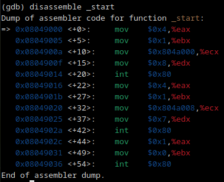
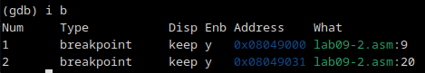

---
## Front matter
title: "Лабораторная работа №9"
subtitle: "Архитектура компьютера"
author: "Мурашов Иван Вячеславович"

## Generic otions
lang: ru-RU
toc-title: "Содержание"

## Bibliography
bibliography: bib/cite.bib
csl: pandoc/csl/gost-r-7-0-5-2008-numeric.csl

## Pdf output format
toc: true # Table of contents
toc-depth: 2
lof: true # List of figures
lot: true # List of tables
fontsize: 12pt
linestretch: 1.5
papersize: a4
documentclass: scrreprt
## I18n polyglossia
polyglossia-lang:
  name: russian
  options:
	- spelling=modern
	- babelshorthands=true
polyglossia-otherlangs:
  name: english
## I18n babel
babel-lang: russian
babel-otherlangs: english
## Fonts
mainfont: PT Serif
romanfont: PT Serif
sansfont: PT Sans
monofont: PT Mono
mainfontoptions: Ligatures=TeX
romanfontoptions: Ligatures=TeX
sansfontoptions: Ligatures=TeX,Scale=MatchLowercase
monofontoptions: Scale=MatchLowercase,Scale=0.9
## Biblatex
biblatex: true
biblio-style: "gost-numeric"
biblatexoptions:
  - parentracker=true
  - backend=biber
  - hyperref=auto
  - language=auto
  - autolang=other*
  - citestyle=gost-numeric
## Pandoc-crossref LaTeX customization
figureTitle: "Рис."
tableTitle: "Таблица"
listingTitle: "Листинг"
lofTitle: "Список иллюстраций"
lotTitle: "Список таблиц"
lolTitle: "Листинги"
## Misc options
indent: true
header-includes:
  - \usepackage{indentfirst}
  - \usepackage{float} # keep figures where there are in the text
  - \floatplacement{figure}{H} # keep figures where there are in the text
---

# Цель работы

Целью данной лабораторной работы является приобретение навыков написания программ с использованием подпрограмм, знакомство с методами отладки при помощи GDB и его основными возможностями.

# Задание

1. Реализация подпрограмм в NASM

2. Отладка программам с помощью GDB

3. Добавление точек останова

4. Работа с данными программы в GDB

5. Обработка аргументов командной строки в GDB

6. Выполнение заданий для самостоятельной работы

# Выполнение лабораторной работы

## Реализация подпрограмм в NASM

Создаю каталог для программам лабораторной работы №9, перехожу в него и создаю файл lab09-1.asm (рис. [-@fig:001]).

{#fig:001 width=70%}

Ввожу в файл lab09-1.asm текст программы из листинга 9.1 (рис. [-@fig:002]).

{#fig:002 width=70%}

**Листинг 1. Пример программы с использованием вызова подпрограммы**

```NASM
%include 'in_out.asm'
SECTION .data
msg: DB 'Введите x: ',0
result: DB '2x+7=',0

SECTION .bss
x: RESB 80
res: RESB 80
SECTION .text
GLOBAL _start
_start:
;------------------------------------------
; Основная программа
;------------------------------------------
mov eax, msg
call sprint
mov ecx, x
mov edx, 80
call sread
mov eax,x
call atoi
call _calcul ; Вызов подпрограммы _calcul
mov eax,result
call sprint
mov eax,[res]
call iprintLF
call quit
;------------------------------------------
; Подпрограмма вычисления
; выражения "2x+7"
_calcul:
mov ebx,2
mul ebx
add eax,7
mov [res],eax
ret ; выход из подпрограммы
```

Создаю исполняемый файл и запускаю его. Проверяю работу программы, вручную посчитав искомое значение. Результаты совпали (рис. [-@fig:003]).

{#fig:003 width=70%}

Изменяю текст программы, добавив подпрограмму _subcalcul в подпрограмму _calcul, для вычисления выражения f(g(x)), где x вводится с клавиатуры, f(x) = 2x + 7, g(x) = 3x − 1. Т.е. x передается в подпрограмму _calcul из нее в подпрограмму _subcalcul, где вычисляется выражение g(x), результат возвращается в _calcul и вычисляется выражение f(g(x)). Результат возвращается в основную программу для вывода результата на экран (рис. [-@fig:004]).

{#fig:004 width=70%}

**Листинг 1.1. Программа с использованием вызова подпрограммы и её подпрограммы**

```NASM
%include 'in_out.asm'
SECTION .data
msg: DB 'Введите x: ', 0
result: DB 'f(g(x))=', 0

SECTION .bss
x: RESB 80
res: RESB 80
SECTION .text
GLOBAL _start
_start:
;------------------------------------------
; Основная программа
;------------------------------------------
mov eax, msg
call sprint
mov ecx, x
mov edx, 80
call sread
mov eax,x
call atoi
call _calcul ; Вызов подпрограммы _calcul
mov eax, result
call sprint
mov eax,[res]
call iprintLF
call quit
;------------------------------------------
; Подпрограмма вычисления
; выражения "2x+7"
_calcul:
call _subcalcul
mov ebx,2
mul ebx
add eax,7
mov [res],eax
ret ; выход из подпрограммы
;------------------------------------------
; Подпрограмма вычисления
; выражения "3x-1"
_subcalcul:
mov ebx, 3
mul ebx
sub eax, 1
ret ; выход из подпрограммы
call _calcul ; Вызов подпрограммы _calcul
```

Создаю исполняемый файл и запускаю его. Проверяю работу программы, вручную посчитав искомое значение. Результаты совпали(рис. [-@fig:005]).

{#fig:005 width=70%}

##  Отладка программам с помощью GDB

Создаю файл lab09-2.asm в каталоге ~/work/arch-pc/lab09 (рис. [-@fig:006]).

{#fig:006 width=70%}

Ввожу в файл lab09-2.asm текст программы из листинга 9.2 (рис. [-@fig:007]).

{#fig:007 width=70%}

**Листинг 2. Программа вывода сообщения Hello world!**

```NASM
SECTION .data
msg1: db "Hello, ",0x0
msg1Len: equ $ - msg1
msg2: db "world!",0xa
msg2Len: equ $ - msg2
SECTION .text
global _start
_start:
mov eax, 4
mov ebx, 1
mov ecx, msg1
mov edx, msg1Len
int 0x80
mov eax, 4
mov ebx, 1
mov ecx, msg2
mov edx, msg2Len
int 0x80
mov eax, 1
mov ebx, 0
int 0x80
```

Получаю исполняемый файл. Для работы с GDB добавляю в исполняемый файл отладочную информацию, для этого провожу трансляцию программ с ключом '-g' (рис. [-@fig:008]).

{#fig:008 width=70%}

Загружаю исполняемый файл в отладчик gdb (рис. [-@fig:009]).

{#fig:009 width=70%}

Проверяю работу программы, запустив её в оболочке GDB с помощью команды run (сокращённо r) (рис. [-@fig:010]).

{#fig:010 width=70%}

Для более подробного анализа программы устанавливаю брейкпоинт на метку _start, с которой начинается выполнение любой ассемблерной программы (рис. [-@fig:011]).

{#fig:011 width=70%}

Запускаю программу (рис. [-@fig:012]).

{#fig:012 width=70%}

Просматриваю дизассимилированный код программы с помощью команды disassemble, начиная с метки _start (рис. [-@fig:013]).

{#fig:013 width=70%}

Переключаюсь на отображение команд с Intel’овским синтаксисом, введя команду set disassembly-flavor intel (рис. [-@fig:014]).

{#fig:014 width=70%}

Просматриваю дизассимилированный код программы, начиная с метки _start (рис. [-@fig:015]).

{#fig:015 width=70%}

Cинтаксис машинных команд в режимe ATT включает в себя использование значка '$' перед операндами, значка '%' перед регистрами в то время как синтаксис в режиме Intel этих значков нет. Также в режиме ATT сначала указываются операнды, а потом регистры. В Intel наоборот - сначала регистры, затем операнды.

Включаю режим псевдографики для более удобного анализа программы рис. [-@fig:016]).

{#fig:016 width=70%}

## Добавление точек останова

На предыдущих шагах была установлена точка останова по имени метки (_start). Проверяю это с помощью команды info breakpoints (кратко i b) (рис. [-@fig:017]).

{#fig:017 width=70%}

Определяю адрес предпоследней инструкции (mov ebx, 0x0) и устанавливаю точку останова рис. [-@fig:018]).

{#fig:018 width=70%}

Просматриваю информацию о всех установленных точках останова (рис. [-@fig:019]).

{#fig:019 width=70%}

## Работа с данными программы в GDB

Просматриваю содержимое регистров с помощью команды info registers (или i r) (рис. [-@fig:020]).

{#fig:020 width=70%}

Выполняю 5 инструкций с помощью команды stepi (или si) (рис. [-@fig:021]).

{#fig:021 width=70%}

Просматриваю содержимое регистров с помощью команды info registers (или i r) (рис. [-@fig:022]).

{#fig:022 width=70%}

Изменились значения регистров eax, ecx, edx, ebx.

Просматриваю значение переменной msg1 по имени (рис. [-@fig:023]).

{#fig:023 width=70%}

Просматриваю значение переменной msg2 по адресу, определяя его по дизассемблированной инструкции (рис. [-@fig:024]).

{#fig:024 width=70%}

Изменяю первый символ переменной msg1 и просматриваю значение msg1 (рис. [-@fig:025]).

{#fig:025 width=70%}

Заменяю 3 символ в переменной msg2 и просматриваю значение msg2 (рис. [-@fig:026]).

{#fig:026 width=70%}

Вывожу в различных форматах (в шестнадцатеричном формате, в двоичном формате и в символьном виде) значение регистра edx (рис. [-@fig:027]).

{#fig:027 width=70%}

С помощью команды set изменяю значение регистра ebx (рис. [-@fig:028]).

{#fig:028 width=70%}

При изменении значения регистра ebx на '2' мы переводим символ в строковый вид (по таблице ASCII символ '2' соответствует 50 а десятичном представлении), а при изменении на 2 число остаётся в строковом виде.

Завершаю выполнение программы с помощью команды continue (сокращенно c) и выхожу из GDB с помощью команды quit (сокращенно q) (рис. [-@fig:029]).

{#fig:029 width=70%}

## Обработка аргументов командной строки в GDB

Копирую файл lab8-2.asm, созданный при выполнении лабораторной работы №8 с программой, выводящей на экран аргументы командной строки (Листинг 8.2) в файл с именем lab09-3.asm (рис. [-@fig:030]).

{#fig:030 width=70%}

Создаю исполняемый файл (рис. [-@fig:031]).

{#fig:031 width=70%}

Загружаю исполняемый файл в отладчик, указав аргументы с помощью ключа --args (рис. [-@fig:032]).

{#fig:032 width=70%}

Устанавливаю точку останова перед первой инструкцией в программе и запускаю её (рис. [-@fig:033]).

{#fig:033 width=70%}

Просматриваю позиции стека (рис. [-@fig:034]).

{#fig:034 width=70%}

Шаг изменения адреса равен 4, так как 

## Выполнение заданий для самостоятельной работы

1. Копирую файл lab8-5.asm в каталог lab09 с новым именем lab09-4.asm (рис. [-@fig:035]).

{#fig:035 width=70%}

Изменяю программу, реализовав вычисление значения функции f(x) как подпрограмму (рис. [-@fig:036]).

{#fig:036 width=70%}

**Листинг 3. Программа вычисления суммы функций для аргументов командной строки**

```NASM
%include 'in_out.asm' 
SECTION .data 
msg db "Функция: f(x) = 8*x - 3",0 
msg1 db "Результат: ",0 
SECTION .text 
global _start 
 
_start: 
pop ecx ; Извлекаем из стека в ecx количество 
        ; аргументов (первое значение в стеке) 
pop edx ; Извлекаем из стека в edx имя программы 
        ; (второе значение в стеке) 
sub ecx,1 ; Уменьшаем ecx на 1 (количество 
        ; аргументов без названия программы) 
mov esi, 0 ; Используем esi для хранения 
        ; промежуточных произведений 
 
next: 
cmp ecx,0h ; проверяем, есть ли еще аргументы 
jz _end ; если аргументов нет выходим из цикла 
        ; (переход на метку `_end`) 
pop eax ; иначе извлекаем следующий аргумент из стека 
call atoi ; преобразуем символ в число 
        ; след. аргумент esi=esi*eax 
call _calcul 
loop next ; переход к обработке следующего аргумента 
 
_end: 
mov eax, msg ; вывод сообщения "Функция: f(x) = 8*x - 3 " 
call sprintLF 
mov eax, msg1 ; вывод сообщения "Результат: " 
call sprint 
mov eax, esi ; записываем произведение в регистр eax 
call iprintLF ; печать результата 
call quit ; завершение программы 
 
_calcul: 
mov ebx, 8 
mul ebx ; "eax = eax*ebx = x*8" 
sub eax, 3 ; "eax = eax - 3 = 8*x - 3" 
add esi, eax
ret
```

Проверяю корректность работы программы (рис. [-@fig:037]).

{#fig:037 width=70%}

Программа работает корректно.

2. Создаю файл lab09-5.asm в каталоге lab09 (рис. [-@fig:038]).

{#fig:038 width=70%}

Ввожу в данный файл программу вычисления выражения (3+2)*4+5 из листинга 9.3 (рис. [-@fig:039]).

{#fig:039 width=70%}

**Листинг 4. Программа вычисления выражения (3+2)*4+5)**

```NASM
%include 'in_out.asm'
SECTION .data
div: DB 'Результат: ',0
SECTION .text
GLOBAL _start
_start:
; ---- Вычисление выражения (3+2)*4+5
mov ebx,3
mov eax,2
add ebx,eax
mov ecx,4
mul ecx
add ebx,5
mov edi,ebx
; ---- Вывод результата на экран
mov eax,div
call sprint
mov eax,edi
call iprintLF
call quit
```

Получаю исполняемый файл (рис. [-@fig:040]).

{#fig:040 width=70%}

Загружаю исполняемый файл в отладчик gdb (рис. [-@fig:041]).

{#fig:041 width=70%}

Запускаю программы. рис. [-@fig:042]).

{#fig:042 width=70%}

В результате выводится '10', а должно получиться '25'. Следовательно, программа работает некорректно. 

Устанавливаю брейкпоинты во всех местах, где происходит вычисление значений (рис. [-@fig:043]).

{#fig:043 width=70%}

С помощью команды continue (сокращённо 'c') просматриваю значения и нахожу ошибки (рис. [-@fig:044]).

{#fig:044 width=70%}

При выполнении инструкции mul значение регистра ecx умножается на значение регистра eax. Добавляю инструкцию 'mov eax, ebx'. Изменяю инструкцию 'add ebx, 5' на 'add eax, 5' и 'mov edi,ebx' на 'mov edi,eax' (рис. [-@fig:045]).

{#fig:045 width=70%}

Создаю исполняемый файл и запускаю его. Проверяю работу программы, вручную посчитав искомое значение. Результаты совпали (рис. [-@fig:046]).

{#fig:046 width=70%}

# Выводы

В ходе выполнения данной лабораторной работы я приобрёл навыки написания программ с использованием подпрограмм, познакомился с методами отладки при помощи GDB и его основными возможностями.

