---
## Front matter
title: "Лабораторная работа №10"
subtitle: "Архитектура компьютера"
author: "Мурашов Иван Вячеславович"

## Generic otions
lang: ru-RU
toc-title: "Содержание"

## Bibliography
bibliography: bib/cite.bib
csl: pandoc/csl/gost-r-7-0-5-2008-numeric.csl

## Pdf output format
toc: true # Table of contents
toc-depth: 2
lof: true # List of figures
lot: true # List of tables
fontsize: 12pt
linestretch: 1.5
papersize: a4
documentclass: scrreprt
## I18n polyglossia
polyglossia-lang:
  name: russian
  options:
	- spelling=modern
	- babelshorthands=true
polyglossia-otherlangs:
  name: english
## I18n babel
babel-lang: russian
babel-otherlangs: english
## Fonts
mainfont: PT Serif
romanfont: PT Serif
sansfont: PT Sans
monofont: PT Mono
mainfontoptions: Ligatures=TeX
romanfontoptions: Ligatures=TeX
sansfontoptions: Ligatures=TeX,Scale=MatchLowercase
monofontoptions: Scale=MatchLowercase,Scale=0.9
## Biblatex
biblatex: true
biblio-style: "gost-numeric"
biblatexoptions:
  - parentracker=true
  - backend=biber
  - hyperref=auto
  - language=auto
  - autolang=other*
  - citestyle=gost-numeric
## Pandoc-crossref LaTeX customization
figureTitle: "Рис."
tableTitle: "Таблица"
listingTitle: "Листинг"
lofTitle: "Список иллюстраций"
lotTitle: "Список таблиц"
lolTitle: "Листинги"
## Misc options
indent: true
header-includes:
  - \usepackage{indentfirst}
  - \usepackage{float} # keep figures where there are in the text
  - \floatplacement{figure}{H} # keep figures where there are in the text
---

# Цель работы

Целью данной лабораторной работы является приобретение навыков написания программ для работы с файлами.

# Задание

1. Выполнение заданий лабораторной работы

2. Выполнение заданий для самостоятельной работы

# Выполнение лабораторной работы

1. Создаю каталог для программам лабораторной работы №10, перехожу в него и создаю файлы lab10-1.asm, readme-1.txt и readme-2.txt (рис. [-@fig:001]).

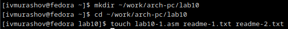{#fig:001 width=70%}

Ввожу в файл lab10-1.asm текст программы из листинга 10.1 (Программа записи в файл сообщения)(рис. [-@fig:002]).

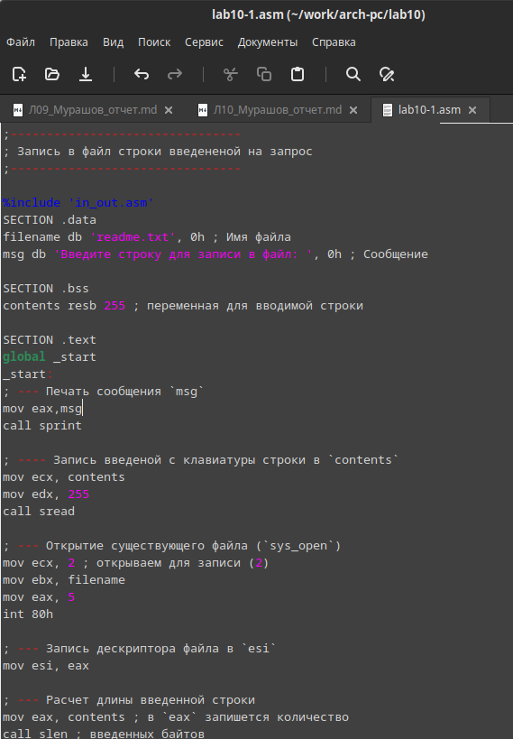{#fig:002 width=70%}

**Листинг 1. Программа записи в файл сообщения**

```NASM
;--------------------------------
; Запись в файл строки введененой на запрос
;--------------------------------

%include 'in_out.asm'
SECTION .data
filename db 'readme-1.txt', 0h ; Имя файла
msg db 'Введите строку для записи в файл: ', 0h ; Сообщение

SECTION .bss
contents resb 255 ; переменная для вводимой строки

SECTION .text
global _start
_start:
; --- Печать сообщения `msg`
mov eax,msg
call sprint

; ---- Запись введеной с клавиатуры строки в `contents`
mov ecx, contents
mov edx, 255
call sread

; --- Открытие существующего файла (`sys_open`)
mov ecx, 2 ; открываем для записи (2)
mov ebx, filename
mov eax, 5
int 80h

; --- Запись дескриптора файла в `esi`
mov esi, eax

; --- Расчет длины введенной строки
mov eax, contents ; в `eax` запишется количество
call slen ; введенных байтов

; --- Записываем в файл `contents` (`sys_write`)
mov edx, eax
mov ecx, contents
mov ebx, esi
mov eax, 4
int 80h

; --- Закрываем файл (`sys_close`)
mov ebx, esi
mov eax, 6
int 80h
call quit
```

2. Создаю исполняемый файл и запускаю его (рис. [-@fig:003]).

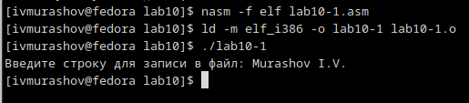{#fig:003 width=70%}

Проверяю корректность работы программы, просматривая содержимое файла readme-1.txt (рис. [-@fig:004])

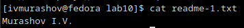{#fig:004 width=70%}

3. С помощью команды chmod запрещаю выполнение исполняемого файла владельцу (рис. [-@fig:004])

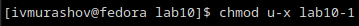{#fig:005 width=70%}

Запускаю исполняемый файл (рис. [-@fig:006]).

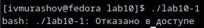{#fig:006 width=70%}

Происходит отказ в доступе, так как выполнение файла было запрещено (u - владелец, (-) - отбор права, x - исполнение файла).

4. С помощью команды chmod изменяю права доступа к файлу lab10-1.asm с исходным текстом программы, добавив права на исполнение и запускаю файл (рис. [-@fig:007])

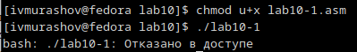{#fig:007 width=70%}

Происходит отказ в доступе, так как исходный файл заблокирован для исполнения.

5. В соответствии с 19 вариантом в таблице 10.4 предоставляю права доступа к файлу readme-1.txt в символьном виде, а для файла readme-2.txt - в двочном виде (рис. [-@fig:008])

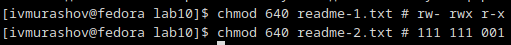{#fig:008 width=70%}

Проверяю правильность выполнения с помощью команды ls -l (рис. [-@fig:009])

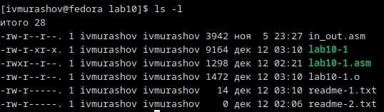{#fig:009 width=70%}

## Выполнение заданий для самостоятельной работы

Пишу программу, работающую по следующему алгоритму:

• Вывод приглашения "Как Вас зовут?"

• ввести с клавиатуры свои фамилию и имя

• создать файл с именем name.txt

• записать в файл сообщение "Меня зовут"

• дописать в файл строку введенную с клавиатуры

• закрыть файл

(рис. [-@fig:010]).

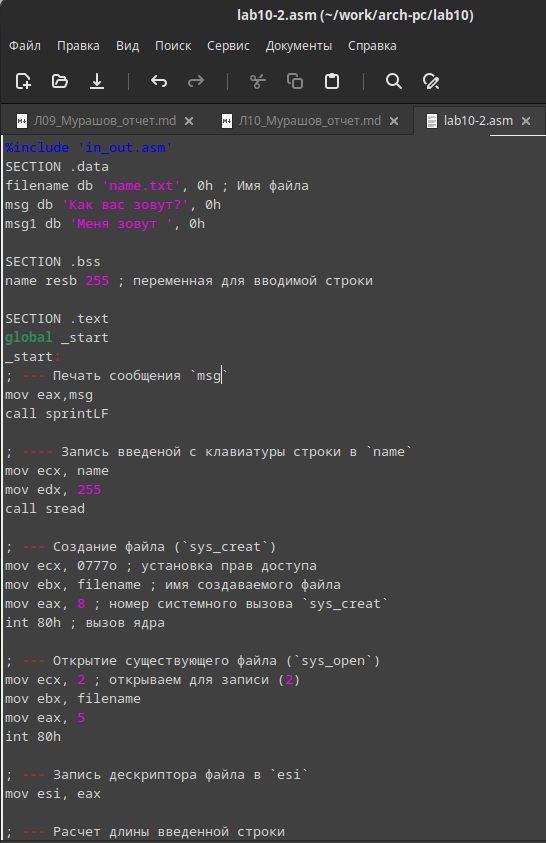{#fig:010 width=70%}

**Листинг 2. Программа создания файла и записи в него сообщения**

```NASM
%include 'in_out.asm'
SECTION .data
filename db 'name.txt', 0h ; Имя файла
msg db 'Как вас зовут?', 0h
msg1 db 'Меня зовут ', 0h

SECTION .bss
name resb 255 ; переменная для вводимой строки

SECTION .text
global _start
_start:
; --- Печать сообщения `msg`
mov eax,msg
call sprintLF

; ---- Запись введеной с клавиатуры строки в `name`
mov ecx, name
mov edx, 255
call sread

; --- Создание файла (`sys_creat`)
mov ecx, 0777o ; установка прав доступа
mov ebx, filename ; имя создаваемого файла
mov eax, 8 ; номер системного вызова `sys_creat`
int 80h ; вызов ядра

; --- Открытие существующего файла (`sys_open`)
mov ecx, 2 ; открываем для записи (2)
mov ebx, filename
mov eax, 5
int 80h

; --- Запись дескриптора файла в `esi`
mov esi, eax

; --- Расчет длины введенной строки
mov eax, msg1 ; в `eax` запишется количество
call slen         ; введенных байтов

; --- Записываем в файл `name` (`sys_write`)
mov edx, eax
mov ecx, msg1
mov ebx, esi
mov eax, 4
int 80h

; --- Расчет длины введенной строки
mov eax, name ; в `eax` запишется количество
call slen         ; введенных байтов

; --- Записываем в файл `name` (`sys_write`)
mov edx, eax
mov ecx, name
mov ebx, esi
mov eax, 4
int 80h

; --- Закрываем файл (`sys_close`)
mov ebx, esi
mov eax, 6
int 80h
call quit
```

Создаю исполняемый файл и запускаю его. Проверяю корректность работы программы, просматривая содержимое каталога lab10 и файла name.txt (рис. [-@fig:011]).

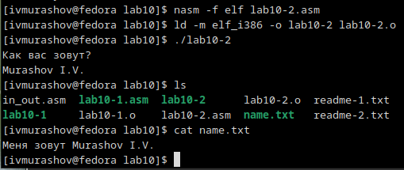{#fig:011 width=70%}

Программа работает корректно.

# Выводы

В ходе выполнения данной лабораторной работы я приобрёл навыки написания программ для работы с файлами.

